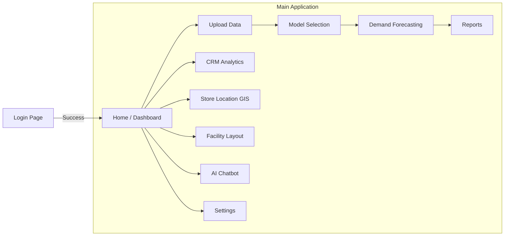
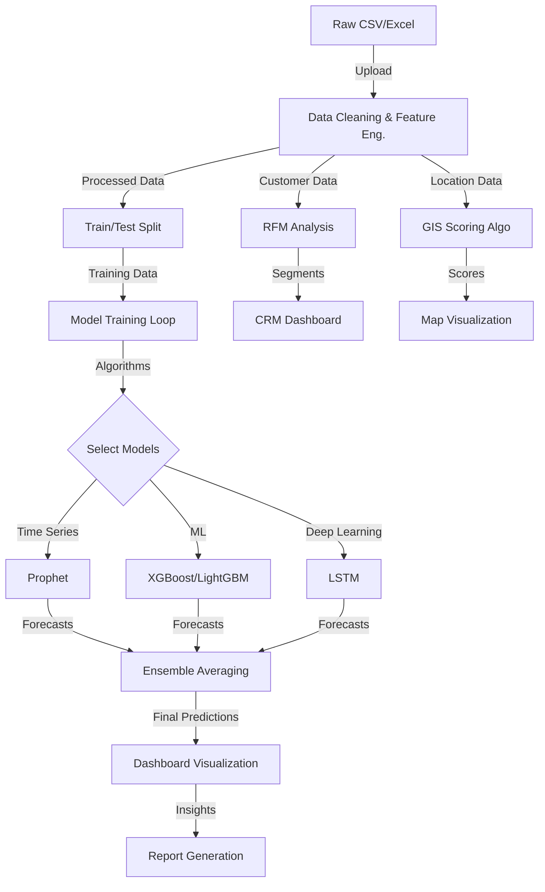

# Unified Retail Intelligence Platform (URIP)
## Project Description & Technical Report

---

### 1. Project Title Options

For a Bachelor of Engineering (B.E.) or Capstone project, the following titles are recommended to reflect the technical depth and scope of the system:

1.  **Unified Retail Intelligence Platform (URIP): An AI-Driven Approach to Supply Chain Optimization and Demand Forecasting**
2.  **Next-Generation Retail Analytics: Integrating Machine Learning, Geospatial Intelligence, and Facility Layout Optimization**
3.  **Smart Supply Chain Management System: Leveraging Generative AI and Ensemble Learning for Strategic Retail Decision Making**
4.  **Data-Driven Retail Transformation: A Comprehensive Platform for Predictive Analytics, CRM, and Location Intelligence**
5.  **Intelligent Retail Ecosystem: Automated Demand Forecasting and Operational Efficiency using Advanced ML Algorithms**

---

### 2. Project Overview

The **Unified Retail Intelligence Platform (URIP)** is a comprehensive, state-of-the-art software solution designed to revolutionize retail operations through the power of Artificial Intelligence, Machine Learning, and Geospatial Analytics. In the highly competitive retail landscape, businesses struggle with fragmented data, inaccurate demand forecasts, inefficient inventory management, and suboptimal store locations.

**Key Problems Solved:**
*   **Demand Uncertainty:** Traditional forecasting methods often fail to capture complex patterns. URIP employs advanced ML models (XGBoost, LSTM, Prophet) to predict sales with high accuracy.
*   **Operational Inefficiency:** Poor facility layouts lead to bottlenecks. URIP uses the Activity Relationship Chart (ARC) methodology to optimize warehouse and store layouts.
*   **Location Blindness:** Choosing store locations without data is risky. URIP's GIS module analyzes demographic and competitor data to recommend optimal expansion sites.
*   **Customer Churn:** Identifying at-risk customers is difficult. URIP's CRM module segments customers and predicts churn using RFM analysis and clustering.
*   **Decision Latency:** Managers lack instant access to insights. URIP's Generative AI Chatbot provides real-time, natural language answers to complex business queries.

**Key Features:**
*   **Multi-Model Forecasting Engine:** Auto-selection of the best model (ARIMA, Prophet, LSTM, etc.).
*   **Geospatial Intelligence:** Interactive maps for store location strategy using KML ward data.
*   **Facility Layout Optimization:** Automated generation of optimal floor plans.
*   **Generative AI Integration:** Google Gemini-powered chatbot and report generation for actionable insights.
*   **Comprehensive CRM:** Customer segmentation, CLV prediction, and churn risk analysis.

---

### 3. File & Folder Structure

```text
Retail Sales Prediction/
├── app.py                      # Main Application Entry Point (Login & Navigation)
├── requirements.txt            # Python Dependencies List
├── assets/                     # Static Assets
│   ├── custom.css              # Global CSS Styling
│   └── urip_logo.png           # Application Logo
├── pages/                      # Streamlit Pages (Modules)
│   ├── 01_Upload_Data.py       # Data Ingestion & Preprocessing
│   ├── 02_Model_Selection.py   # Model Configuration & Training
│   ├── 03_Dashboard.py         # Main Analytics Dashboard
│   ├── 04_Reports.py           # Automated Report Generation
│   ├── 05_Settings.py          # System Configuration
│   ├── 06_Demand_Forecasting.py# Detailed Forecasting Analysis
│   ├── 07_CRM_Analytics.py     # Customer Relationship Management
│   ├── 08_Facility_Layout.py   # Warehouse/Store Layout Optimization
│   ├── 09_AI_Chatbot.py        # Generative AI Assistant
│   └── 10_Store_Location_GIS.py# GIS & Location Intelligence
├── utils/                      # Utility Modules
│   ├── database.py             # SQLite Database Management
│   ├── gemini_ai.py            # Google Gemini API Wrapper
│   ├── models.py               # ML Model Implementations (Prophet, XGB, etc.)
│   └── ui_components.py        # Reusable UI Widgets (Sidebar, Cards)
└── data/                       # Data Storage
    ├── bbmp_final_new_wards.kml# Bangalore Ward Boundaries (GIS)
    └── sample_retail_data.csv  # Demo Dataset
```

---

### 4. Module-by-Module Description

#### **1. Upload Data (`01_Upload_Data.py`)**
*   **Purpose:** Serves as the entry point for data ingestion, ensuring data quality before analysis.
*   **Inputs:** CSV or Excel files containing `Date`, `Sales` (Required), `Store`, `Category`, `Units_Sold`, `Promotion` (Optional).
*   **Outputs:** Cleaned and preprocessed DataFrame stored in `st.session_state.processed_data`.
*   **Key Functionality:**
    *   **Validation:** Checks for missing values, duplicates, and correct data types.
    *   **Preprocessing:** Offers options for missing value imputation (Forward Fill, Interpolate), outlier removal (IQR method), and scaling (StandardScaler, MinMaxScaler).
    *   **Feature Engineering:** Automatically generates lag features (1-day, 7-day), rolling means, and datetime features (Day of Week, Month).

#### **2. Model Selection (`02_Model_Selection.py`)**
*   **Purpose:** Allows users to configure and train various forecasting models to find the best fit for their data.
*   **Inputs:** Processed data from the Upload module.
*   **Outputs:** Trained model objects and performance metrics (MAE, RMSE, MAPE, R²) stored in `st.session_state.forecast_results`.
*   **Key Functionality:**
    *   **Aggregation:** Users can aggregate data by Total, Store, or Category.
    *   **Model Training:** Supports parallel training of ARIMA, Random Forest, LightGBM, XGBoost, LSTM, and Ensemble models.
    *   **Comparison:** Displays a leaderboard of models based on error metrics to identify the "Best Model".

#### **3. Dashboard (`03_Dashboard.py`)**
*   **Purpose:** Provides a high-level executive summary of business performance.
*   **Inputs:** Forecast results and historical sales data.
*   **Outputs:** Interactive charts and KPI cards.
*   **Key Functionality:**
    *   **KPIs:** Displays Total Sales, Average Daily Sales, and Growth Rates.
    *   **Visualizations:** Time-series plots of Actual vs. Forecasted sales.
    *   **Drill-down:** Allows filtering by specific stores or categories.

#### **4. Reports (`04_Reports.py`)**
*   **Purpose:** Generates downloadable PDF or Word reports for stakeholders.
*   **Inputs:** Analysis results from all other modules.
*   **Outputs:** `.docx` or `.pdf` files.
*   **Key Functionality:**
    *   **Automated Summarization:** Compiles charts, metrics, and AI-generated insights into a formatted document.

#### **5. Settings (`05_Settings.py`)**
*   **Purpose:** Manages global application settings and user preferences.
*   **Inputs:** User configuration.
*   **Outputs:** Updated `st.session_state` configuration.
*   **Key Functionality:**
    *   **Theme:** Toggle between Light/Dark mode.
    *   **Parameters:** Set default forecast horizon, confidence levels, and currency symbols.

#### **6. Demand Forecasting (`06_Demand_Forecasting.py`)**
*   **Purpose:** Offers deep-dive analysis into demand patterns and promotional impacts.
*   **Inputs:** Historical sales, promotion flags, units sold.
*   **Outputs:** Detailed forecast plots with confidence intervals, promotional lift metrics.
*   **Key Functionality:**
    *   **Promotional Analysis:** Calculates the "Lift" in sales during promotion periods vs. non-promotion periods.
    *   **Units Forecasting:** Predicts physical inventory requirements (Units Sold) separate from revenue (Sales).
    *   **Volatility Analysis:** Identifies high-variance products requiring safety stock.

#### **7. CRM Analytics (`07_CRM_Analytics.py`)**
*   **Purpose:** Focuses on customer retention and value maximization.
*   **Inputs:** Transactional data with Customer IDs.
*   **Outputs:** Customer segments, Churn probabilities, CLV estimates.
*   **Key Functionality:**
    *   **RFM Analysis:** Segments customers based on Recency, Frequency, and Monetary value.
    *   **Clustering:** Uses K-Means to group customers into "Champions", "Loyal", "At Risk", etc.
    *   **Churn Prediction:** Logistic Regression model to predict likelihood of customer attrition.

#### **8. Facility Layout (`08_Facility_Layout.py`)**
*   **Purpose:** Optimizes the physical arrangement of departments in a store or warehouse.
*   **Inputs:** List of departments, Activity Relationship Chart (ARC) ratings (A, E, I, O, U, X).
*   **Outputs:** Optimized grid layout, Material flow diagram (Sankey).
*   **Key Functionality:**
    *   **Graph Theory:** Represents departments as nodes and relationships as edge weights.
    *   **Heuristic Optimization:** Places highly related departments (Rated 'A') adjacent to each other to minimize travel distance.

#### **9. AI Chatbot (`09_AI_Chatbot.py`)**
*   **Purpose:** Provides a conversational interface for data querying and insight generation.
*   **Inputs:** User natural language queries, uploaded images/documents.
*   **Outputs:** Text responses, analyzed insights.
*   **Key Functionality:**
    *   **Gemini Integration:** Sends context-aware prompts to Google's Gemini Pro model.
    *   **Multimodal Analysis:** Can analyze uploaded charts (images) or reports (PDFs) and summarize them.
    *   **Fallback Logic:** Provides rule-based responses if the API is unavailable.

#### **10. Store Location GIS (`10_Store_Location_GIS.py`)**
*   **Purpose:** Assists in strategic site selection for new stores.
*   **Inputs:** KML files (Ward boundaries), Demographic data, Competitor locations.
*   **Outputs:** Interactive maps, Location scores.
*   **Key Functionality:**
    *   **Spatial Analysis:** Calculates distance to nearest competitors using Geopy.
    *   **Scoring Algorithm:** Ranks locations based on Population Density (40%), Competitor Distance (30%), and Accessibility (20%).
    *   **Visualization:** Folium maps with Choropleth layers for population and markers for stores.

---

### 5. Machine Learning & Analytics Logic

The platform utilizes a robust suite of algorithms defined in `utils/models.py`:

1.  **Prophet (Facebook):**
    *   **Type:** Additive Regression Model.
    *   **Use Case:** Handles seasonality (daily, weekly, yearly) and holiday effects robustly.
    *   **Features:** `ds` (date), `y` (value), `holidays`.
2.  **XGBoost (Extreme Gradient Boosting):**
    *   **Type:** Gradient Boosted Decision Trees.
    *   **Use Case:** High-performance regression for complex, non-linear patterns.
    *   **Features:** Lags (1, 7, 30 days), Rolling Means, Day of Week, Month, Is_Weekend.
3.  **LightGBM:**
    *   **Type:** Gradient Boosting (Leaf-wise growth).
    *   **Use Case:** Faster training speed and higher efficiency for large datasets.
4.  **Random Forest:**
    *   **Type:** Bagging Ensemble.
    *   **Use Case:** Baseline model, robust to outliers and overfitting.
5.  **LSTM (Long Short-Term Memory):**
    *   **Type:** Recurrent Neural Network (Deep Learning).
    *   **Use Case:** Captures long-term temporal dependencies in sequential data.
    *   **Architecture:** Input -> LSTM(50 units) -> Dropout(0.2) -> Dense(1).
6.  **ARIMA:**
    *   **Type:** Statistical Linear Model.
    *   **Use Case:** Short-term forecasting for stationary time series.
7.  **K-Means Clustering (CRM):**
    *   **Use Case:** Unsupervised customer segmentation based on RFM scores.

**Metrics Calculated:**
*   **MAE (Mean Absolute Error):** Average magnitude of errors.
*   **RMSE (Root Mean Squared Error):** Penalizes large errors.
*   **MAPE (Mean Absolute Percentage Error):** Percentage error for interpretability.
*   **R² (Coefficient of Determination):** Goodness of fit.

---

### 6. GIS / Store Location Logic

*   **Data Source:** Uses `bbmp_final_new_wards.kml` for Bangalore ward boundaries and population attributes.
*   **Processing:**
    *   Parses KML using `fiona` / `xml.etree` to extract Polygon geometries and metadata.
    *   Converts to `GeoDataFrame` using `geopandas`.
*   **Scoring Logic:**
    $$ Score = (Pop_{norm} \times 0.4) + (Dist_{competitor} \times 0.3) + (Access_{score} \times 0.2) + (Socio_{score} \times 0.1) $$
    *   Higher population = Higher score.
    *   Larger distance from competitor = Higher score (less saturation).
*   **Visualization:** Renders interactive maps using `folium`, adding layers for Ward Boundaries (Choropleth) and Store Markers (Cluster).

---

### 7. Facility Layout Logic

*   **Methodology:** Systematic Layout Planning (SLP) using Activity Relationship Charts (ARC).
*   **Input:** User defines relationships between departments:
    *   **A (Absolutely Necessary):** Weight 10
    *   **E (Especially Important):** Weight 5
    *   **I (Important):** Weight 2
    *   **O (Ordinary):** Weight 1
    *   **U (Unimportant):** Weight 0
    *   **X (Undesirable):** Weight -10
*   **Algorithm:**
    1.  Constructs a weighted graph where nodes = departments, edges = relationship weights.
    2.  Calculates "Total Closeness Rating" (TCR) for each node.
    3.  Places the node with max TCR in the center of the grid.
    4.  Places connected 'A' rated nodes adjacent to the center.
*   **Output:** A grid-based block layout and a NetworkX graph visualization showing connection strengths.

---

### 8. AI Chatbot Logic

*   **Architecture:** Hybrid system using Google Gemini API with a local fallback rule engine.
*   **Context Injection:**
    *   System Prompt: "You are an expert retail analyst..."
    *   Data Context: Summarized dataframe statistics (Total Sales, Top Categories) are appended to the user prompt.
*   **Multimodal Capabilities:**
    *   Uses `Gemini Vision` model to analyze uploaded images (e.g., a plot of sales trends) and describe them in text.
*   **Document Analysis:**
    *   Extracts text from PDF/Docx using `PyPDF2`/`python-docx`.
    *   Sends text to LLM for summarization, trend extraction, or strategic recommendations.

---

### 9. Data Storage & Session Management

*   **SQLite Database (`users.db`):**
    *   **Users Table:** `id`, `username`, `password_hash` (SHA-256), `email`, `role`, `created_at`.
    *   **Sessions Table:** Tracks active user sessions for security.
*   **Streamlit Session State (`st.session_state`):**
    *   Acts as a volatile in-memory data store for the user session.
    *   **Keys:** `uploaded_data` (Raw DF), `processed_data` (Cleaned DF), `forecast_results` (Dict of models), `user_info` (Auth details).
*   **Persistence:**
    *   Uploaded files are processed in memory (not saved to disk to preserve privacy).
    *   Trained models are cached in session state but can be pickled if needed.

---

### 10. User Flow / Application Workflow

1.  **Authentication:** User logs in via `app.py`. System verifies credentials against SQLite DB.
2.  **Data Ingestion:** User navigates to **Upload Data**. Uploads a CSV. System validates columns and cleans data.
3.  **Model Configuration:** User goes to **Model Selection**. Chooses "Sales" as target, selects "XGBoost" and "Prophet". Clicks "Train".
4.  **Analysis:**
    *   User views **Dashboard** to see the forecast vs actuals.
    *   User checks **Demand Forecasting** to see promotional lift.
    *   User checks **CRM Analytics** to identify "At Risk" customers.
5.  **Strategic Planning:**
    *   User opens **Store Location GIS** to find a location for a new branch.
    *   User uses **Facility Layout** to design the new store's floor plan.
6.  **Insight Generation:** User asks **AI Chatbot**: "Summarize the sales trend for Q4". Chatbot responds with insights.
7.  **Reporting:** User goes to **Reports**, generates a PDF summary, and downloads it.

---

### 11. System Diagrams (Mermaid)

#### **A) Layered System Architecture**

```mermaid
flowchart TB
    subgraph Presentation_Layer ["Presentation Layer (Streamlit UI)"]
        UI[Streamlit Frontend]
        Pages[Sidebar Modules: Upload, Models, Dashboard, CRM, GIS, etc.]
    end

    subgraph Application_Layer ["Application Layer"]
        Auth[Auth Manager]
        Session[Session State Manager]
        Router[Page Router]
    end

    subgraph Logic_Layer ["ML & Logic Layer"]
        Forecaster[Forecasting Engine (Prophet, XGB, LSTM)]
        GIS_Engine[GIS Processor (Folium, GeoPandas)]
        Layout_Engine[Layout Optimizer (NetworkX)]
        CRM_Engine[CRM Analytics (K-Means, RFM)]
        Chatbot_Engine[AI Assistant (Gemini Wrapper)]
    end

    subgraph Data_Layer ["Data Layer"]
        DB[(SQLite User DB)]
        MemStore[In-Memory Session State]
        Files[External Files (CSV, KML, Assets)]
    end

    subgraph External_Services ["External Services"]
        Gemini[Google Gemini API]
        Maps[Map Tiles Service]
    end

    UI --> Pages
    Pages --> Router
    Router --> Auth
    Auth --> DB
    Pages --> Session
    
    Pages --> Forecaster
    Pages --> GIS_Engine
    Pages --> Layout_Engine
    Pages --> CRM_Engine
    Pages --> Chatbot_Engine

    Forecaster --> MemStore
    GIS_Engine --> Files
    Chatbot_Engine --> Gemini
    GIS_Engine --> Maps
```

#### **B) Navigation / User Flow Diagram**



#### **C) Data Flow / Processing Pipeline**


